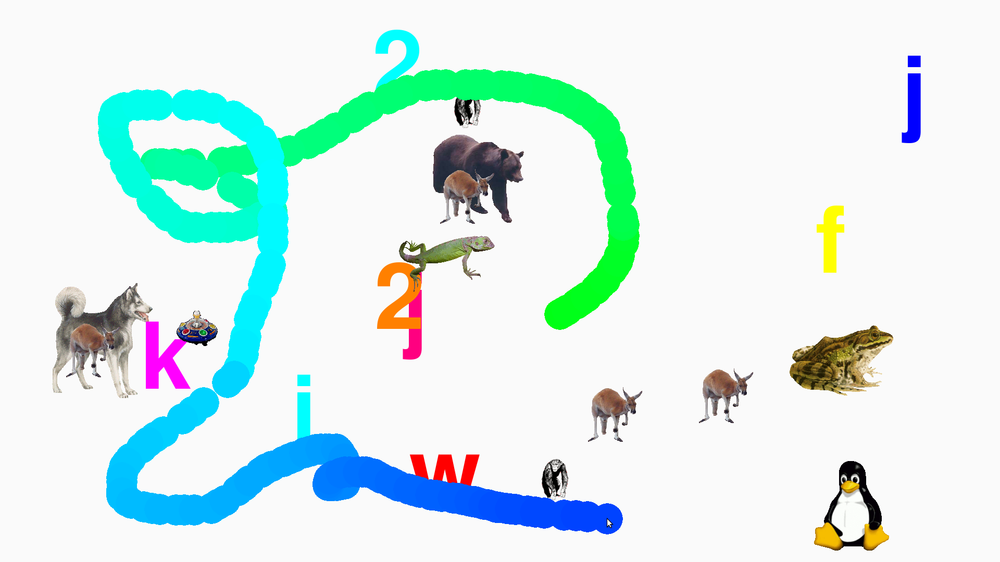

# Bambam

[](https://travis-ci.com/porridge/bambam)
[](https://hosted.weblate.org/engage/bambam/)

Bambam is a simple baby keyboard (and gamepad) masher application that locks the keyboard and mouse and instead displays bright colors, pictures, and sounds.  While OSX has great programs like [AlphaBaby](http://www.kldickey.addr.com/alphababy/), the original author couldn't find anything for Linux and having wanted to learn Python for a while, Bambam was his excuse.



## Installation

### From a distribution package

First, see if your distribution has a bambam package already.
This way takes care of dependencies, translated program messages, `.desktop` files and manual pages.

For example:
```
sudo apt install bambam
man bambam
```

### Manual installation

Before installing this application, ensure you have the following installed:
  * [Python](http://python.org) - version 3.x is recommended but version 2.7 should work too
  * [Pygame](http://www.pygame.org/) - version 2.x is recommended, but version 1.9 may work too

If not, you can install it manually as follows:
  1. [Download](https://github.com/porridge/bambam/releases) the `bambam-1.2.0.zip` or `bambam-1.2.0.tar.gz` file.
  1. Unzip bambam-1.2.0.zip or `tar zxvf bambam-1.2.0.tar.gz` to create the `bambam-1.2.0` directory.
  1. Change into the 'bambam-1.2.0' directory
```
cd bambam-1.2.0
```

If you would like to take advantage of the recommended way to start the game (see the next section) do the following:

```
sed -i -e "s,/usr/games/bambam,`pwd`/bambam.py," bambam-session.desktop
sudo mkdir -p /etc/X11/sessions
sudo cp bambam-session.desktop /etc/X11/sessions/
```

For an alternative way to start the game from your applications menu, do the following:
```
sed -i -e "s,/usr/games/bambam,`pwd`/bambam.py," bambam.desktop
mkdir -p ~/.local/share/applications
cp bambam.desktop ~/.local/share/applications/
```

## Usage

Once installed, there are two ways to run the game:
1. **Recommended**: as a dedicated graphical session.

   When logging into your system, look for a gear icon, which opens a drop-down
   menu of available session types. Select BamBam and log in.

   This way only the game is launched, and the user is logged out as soon as
   the game quits.  Thanks to this, a child is not able to cause any damage
   even if he or she somehow manages to quit the game.

   This way is safer, but more cumbersome.
2. Directly from a terminal, or applications menu.

   Select the game from your applications menu, or to run the game from a
   terminal window, type `bambam` if you installed from a distribution package, or
   `./bambam.py` if you installed manually.

   This way the program runs as part of a regular session. The game tries to
   grab the keyboard and mouse pointer focus in order to prevent a child from
   exiting the game or switching away from it. However it is not 100%
   bulletproof, depending on the exact environment.

   This way is easier, but potentially more risky. Take care when leaving your
   child unattended with the game.

## Exiting

To exit, just directly type the command mentioned in the upper left-hand corner of the window. In the English locales, this is:
```
quit
```

More information is in the man page. To view it, type:
```
man ./bambam.6
```

Comments or suggestions? Any feedback is appreciated, please send it to [the bambam-users forum](https://groups.google.com/forum/#!forum/bambam-users).

Translations for this game are done on [Weblate](https://hosted.weblate.org/projects/bambam/). Please help translating for your mother tongue!

## History

This project was moved from [its code.google.com location](https://code.google.com/p/bambam/) in April 2015, since that site was about to be shut down.

Note that changes (as of 2010-08-17) from [the launchpad bambam fork](https://launchpad.net/bambam) had been merged back to this project in February 2014.
